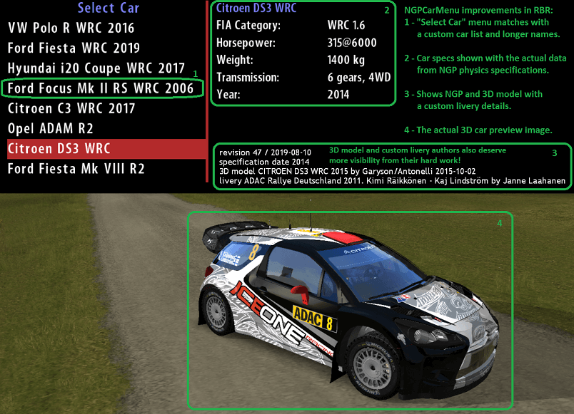
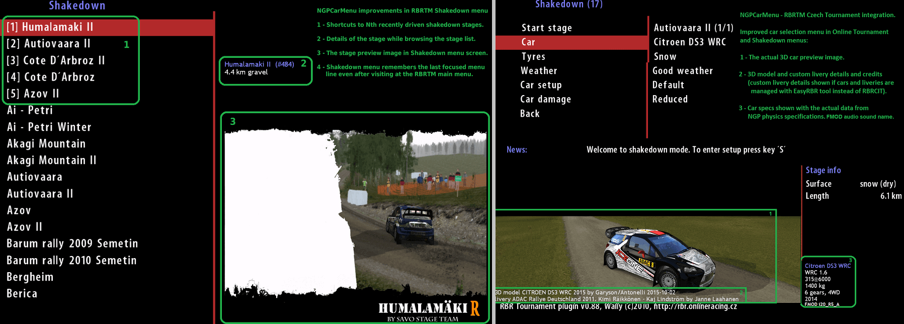
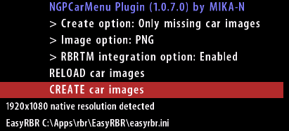

# NGPCarMenu

Custom plugin for **Richard Burns Rally game (RBR v1.02 SSE)** to improve the "Select Car" in-game menu and RBRTM and RBR_RX "Select Stage" menus (ie. for those people who don't use external RBR game launchers). 

The original RBR game and RBRTM and RBR_RX plugins have various problems and limitations:
- The car menu name and preview image of the car (garage) doesn't match with the custom car model. The car specification details shown in a car selection screen don't match with the custom NGP car details.
- RBRTM doesn't show custom car details or car preview images. Stage selection doesn't show a map preview image and doesn't remember which stages you have driven lately.
- RBR_RX stage selection menu list doesn't scroll (limited to 20 BTB stages), it doesn't show map preview images and doesn't remember the stages you have driven lately.
- RBR_RX replay files cannot be replayed afterwards. You can replay those only once right after the stage is finished and before you go back to RBR main menu. After this you cannot replay RBRRX/BTB recordings.
- RBR has a bug how it handles inverted pedals (input.ini) at startup or after alt-tabbing to a desktop. For example throttle goes to 100% until a driver presses the inverted pedal at least once.

Good news! **NGPCarMenu plugin solves these issues** by doing following enhancements in RBR:
- Shows the actual NGP car specs (HP, gears, transmission), car preview images and 3D car model details in **RBR/RBRTM/RBRRX** menu screens.
- RBRTM: Shows Nth recently driven stages as a shortcut menu entries on top of the Shakedown stage list (easier and faster to choose your favorite stages and re-drive those).
- RBRTM: Remembers the focused stage menu line even after visiting the RBRTM main menu (without NGPCarMenu plugin RBRTM would always reset back to the first menu line after visiting RBRTM main menu).
- RBRTM: Shows a minimap of the track layout in stage selection screens.
- RBRRX: Scrollable BTB stages menu list (pageUp/pageDown/home/end/arrow keys navigation).
- RBRRX: Shows the stage information (length, pacenotes created or not, surface, author, version, date. See BTB track specific track.ini metadata file).
- RBRRX: Shows Nth recently driven stages as a shortcut menu entries on top of the RBR_RX stage list.
- RBRRX: Shows a minimap of the track layout in stage selection screens.
- RBRRX: Supports RBRRX/BTB replay files (ie. BTB replay files can be replayed at anytime, not just right after finishing the race).
- "AutoLogon" feature opens automatically the menu screen of your favorite plugin when RBR is launched (for example takes you to RBRTM, RBR_RX or RallySimFans menu screen).
- "Rename profile" feature renames the driver profile while preserving profile settings (ie. you no longer have to call yourself as MULLIGATAWNY. Now you can rename the driver via NGPCarMenu plugin and still keep all maps and cars unlocked).
- Inverted pedals behave correctly right away without going through the hassle of pressing all pedals at least once while waiting for a countdown.

The plugin supports **RBRTM Czech Tournament** plugin (V0.88) integration. Use NGPCarMenu in-game menu or INI file to enable/disable this integration. 
**RBR_RX** plugin (RBR_RX.dll with 417792 bytes, the file doesn't have version tag) integration. Use NGPCarMenu in-game menu or INI file to enable/disable this integration. 
**RallySimFans** plugin (RSF). Refer to RSF home page for more information. 
**RBRPro** RBR bundle. Refer to RBRPro home page for more information. 

## Download
- **[The latest build of NGPCarMenu](https://github.com/mika-n/NGPCarMenu/releases)**

## Installation
- **Download the latest version** from the link shown above (ZIP file).
- **Unzip the NGPCarMenu-versionTag.zip file** to the root folder of existing installation of RBR game (for example *c:\games\richardBurnsRally*).
- **Launch RichardBurnsRally_SSE.exe** and navigate to *Options/Plugins/NGPCarMenu* in-game menu to enable/disable various options based on your personal preferences.
- If this was the first time you used NGPCarMenu plugin in RBR then you probably don't have any car preview images. Choose "CREATE car images" command to generate new car preview images for the currently installed custom cars in RBR.
- **You are now ready to race!**
-
- For advanced tweaks you can customize various options in *Plugins\NGPCarMenu.ini* file.
- See especially the *RBRCITCarListPath* option if NGP car spec details are missing in RBR in-game menus. This option should point to the carList.ini file from NGP physics plugin (by default *RBRCIT\carlist\carList.ini* which is a relative path under the RBR installation folder).
- Alternatively you can use EasyRBR tool to setup cars. In that case uncomment the EasyRBRPath option in NGPCarMenu.ini and set path to EasyRBR\easyrbr.ini file.
- If you are tired of doing half a dozen of key presses to open your favorite plugin ("Load profile/Options/Plugins/MyFavouritePlugin") then set AutoLogon option and NGPCarMenu takes you there automatically when RBR is launched.

The NGPCarMenu.ini file has various screen resolution specific options. There are default values for the most common resolutions, but if the resolution you use is not there the plugin adds it there automatically with default values. Refer to NGPCarMenu.ini.sample for more information about new options.

Note! If you use Windows Explorer integrated unzip tool to unzip the package then rbr\Plugins\NGPCarMenu.dll file may be in "blocked" state in some PC environments because the file was downloaded from Internet. To solve this issue choose properties of NGPCarMenu.dll file (right mouse button click and Properties popup menu) and untick "blocked" option. Or use better zip tools like 7-Zip.org or WinRAR to unzip packages.

## Upgrading from an old version
- Download the latest version from the Releases-link shown above.
- Make sure RBR game is not running and locking the existing NGPCarMenu.dll file.
- Unzip the package on top of the existing installation and let the unzip tool to overwrite all existing files (the zip contains only NGPCarMenu related files).
- You won't loose your existing rbr\Plugins\NGPCarMenu.ini settings because the new version overwrites only the NGPCarMenu.ini.sample configuration file and not the NGPCarMenu.ini you may have customized. If you want to read more about new options then take a look at this NGPCarMenu.ini.sample file or Readme.txt file. However, the new version will initialize all new options with de1ault values, so the old INI file continues to work.

## Configuration
rbr\Plugins\NGPCarMenu.ini options (see the NGPCarMenu.ini.sample file for more details):
| Option                 | Comment                                                                                |
|------------------------|----------------------------------------------------------------------------------------|
| AutoLogon              | Disabled, Main, Plugins, custom plugin name. If this is set then NGPCarMenu opens the specified menu screen automatically when RBR is launched. If you have multi-profile RBR then see AutoLogonWaitProfileSelection option also. |
| AutoLogonWaitProfileSelection | 0 (disabled) or 1 (enabled). If autologon is set and you have multiple profiles in RBR then setting this option to value 1 lets you to select a profile before autologon sequence does it job. If set to value 0, NGPCarMenu autologon selects automatically the first profile. |
| InvertedPedalsStartupFix | 0 or 1. If enabled (default) then NGPCarMenu fixes the notorious "inverted pedals" RBR bug when the car is at starting line (ie. throttle goes to 100% until a driver presses the inverted pedal at least once). |
| ScreenshotPath         | Path of car preview images (relative to RBR executable location or absolute path). Supports various runtime variables (see NGPCarMenu.ini.sample for more details) |
| ScreenshotReplay       | Replay filename the plugin uses to generate preview images. |
| ScreenshotFileType     | PNG or BMP file format in car preview image files. There is also in-game plugin option to set this value. |
| ScreenshotAPIType      | 0 or 1. 0=DirectX framebuffer capture while creating preview images. 1=GDI capture. Some Win7 PCs seemed to have issues with DX9 framebuffer captures (wrong colors), so this option 1 (GDI) may help in those scenarios. |
| LanguageFile           | Path to localization file (localized text labels shown in RBR car selection screen). English is the default language. |
| RBRCITCarListPath      | Path to NGP carList.ini configuration file (NGP car specs). If you use RBRCIT tool then the tool has downloaded the file in RBRCIT folder. |
| EasyRBRPath            | Path to EasyRBR.ini configuration file (EasyRBR car manager tool configurations). By default this is commented out, so NGPCarMenu assumes RBRCIT tool is used. By uncommenting this line NGPCarMenu uses custom car information from EasyRBR car manager tool. |
| ScreenshotCropping     | Cropping rectangle for the screenshot. Make it "big enough but not too big" to fill the bottom part of "Select Car" RBR menu screen (empty string or 0 0 0 0 uses full screen in a car preview images). |
| CarSelectLeftBlackBar  | Optional rectangle black bar to hide the stock RBR "left frame" image in "Select Car" menu (empty string or 0 0 0 0 disables the black side bar). The first value (left pos) also defines the X-pos where the car preview image is drawn. |
| CarSelectRightBlackBar | (the same as above) |
| Car3DModelInfoPosition | 3D model into textbox X Y position. Empty or missing uses the default position. 320 200 would set both X and Y positions, but having just 320 value would set X position only and Y would be at default position. |
| CarPictureScale        | Scaling of the car picture in the built-in RBR car selection menus (-1=no scaling or stretching (default), 0=Stretch to fill the picture area (ignore aspect ratio), 3=Scale while keeping the aspect ratio and place the image on the bottom of the picture rectangle area. |
| CarPictureUseTransparent | 0 or 1. 0=No transparent support with PNG files. 1=If PNG file has a transparent background then use it (alpha channel) |
| ScreenshotCarPosition  | Car position while taking the car preview screenshot. 0=The default location on the road, 1=The car is on the sky in the middle of nowhere |
| ScreenshotCamPosition  | Camera position while taking the screenshot. *(not yet implemented)* |
| RBRTM_Integration      | 0 or 1. 0=RBRTM integration disabled. 1=RBRTM integration enabled (if the RBRTM plugin is installed and it is V0.88 version) |
| RBRTM_CarPictureRect   | Rectangle coordinates where the car preview image is drawn in RBRTM Shakedown and OnlineTournament menus (left top right bottom). Tweak this value if the image is drawn at wrong location. |
| RBRTM_CarPictureCropping | Rectangle coordinates of cropping area of the preview image shown in RBRTM menus *(not yet implemented)* |
| RBRTM_CarPictureScale  | Scaling of the car picture in the RBRTM car selection menus (0=Stretch to fill the picture area, 3=Scale while keeping the aspect ratio and place the image on the bottom of the picture rectangle area (default). |
| RBRTM_CarPictureUseTransparent | 0 or 1. 0=No transparent support with PNG files. 1=If PNG file has a transparent background then use it (alpha channel) |
| RBRTM_MapScreenshotPath | Path of custom map preview images (relative to RBR.EXE location or absolute path). NGPCarMenu uses map preview images from this folder location. If the file is missing then the plugin uses a map specific Maps\Tracks.ini SplashScreen option as a preview image. |
| RBRTM_MapPictureRect   | Location of the map preview image on RBRTM Shakedown stages menu screen (x1 y1 x2 y2, values in screen coordinates). If missing or empty then NGPCarMenu plugin draws the image at default location. |
| RBRTM_MinimapPictureRect | Location of the minimap in stage selecton menu screen. 0=Disables the minimap feature. By default the minimap is drawn on top of the map preview image |
| RBRTM_MapPictureRectOpt | The same as above, but for the options screen following the stages menu list (ie. when a stage has been already selected) |
| RBRTM_MinimapPictureRectOpt | (see the comment above) |
| RBRTM_RecentMapsMaxCount | Maximum number of recent driven maps shown on top of the RBRTM Shakedown stages menu list (shortcuts to a map) |
| RBRRX_Integration      | 0 or 1. 0=RBRRX integration disabled. 1=RBRRX integration enabled |
| RBRRX_MapScreenshotPath | Path of custom map preview images (relative to RBR.EXE location or absolute path) |
| RBRRX_MapPictureRect   | Location of the map preview image on RBR_RX stages menu screen (x1 y1 x2 y2, values in screen coordinates). If missing or empty then NGPCarMenu plugin draws the image at default location. |
| RBRRX_MinimapPictureRect | Location of the minimap in stage selecton menu screen. 0=Disables the minimap feature. By default the minimap is drawn on top of the map preview image |
| RBRRX_MapPictureRectOpt | The same as above, but for the options screen following the stages menu list (ie. when a stage has been already selected) |
| RBRRX_MinimapPictureRectOpt | (see the comment above) |
| RBRRX_RecentMapsMaxCount | Maximum number of recent driven maps shown on top of the RBR_RX stages menu list (shortcuts to a map) |
| GenerateReplayMetadataFile | 0 or 1. Generates a replay metadata INI file when a new RBR, RBRTM or RBRRX replay is saved in Replays folder. BTB replay in NGPCarMenu needs this metadata file, so don't disable this if you want to replay BTB recordings afterwards. |

## Questions and Answers
- **Does "Create car image" command overwrite existing car preview images?** No, the plugin uses *"Create only missing images"* option by default. However, you can change this option in the plugin's in-game menu to *"All car images"* option. This option re-creates all car images.
- **Can I use my own PNG picture files in the preview subfolder?** Yes you can. See **rbr\Plugins\NGPCarMenu\preview\resolution** folder after you have done "Create car images" menu command in NGPCarMenu plugin at least once. If you don't like the preview images created by the plugin then you can use any PNG file as long the filename matches with the car model name used in NGP physics plugin (carList.ini name entries).
- **Why the "Create car image" command doesn't seem to generate any new files under Plugins\NGPCarMenu\preview folder?** Some PC setups and Windows UAC settings prevent applications to write anything below *c:\program files* or *c:\program files (x86)* folder. Try to use some other folder in NGPCarMenu.ini ScreenshotPath option or copy the whole RBR game folder structure to, for example, *c:\games\rbr* folder.
- **The plugin creates too big/too small/badly cropped car preview images. How to tweak the image?** Tweak NGPCarMenu.ini ScreenshotCropping setting. The option uses screen pixel values to set a rectangle area used in a screenshot. Values are relative to the RBR in-game window (0 0 is the left-top pixel of RBR game window).
- **Why the plugin creates just empty black PNG preview image files?** You probably have *fullscreen=true* value in **rbr\RichardBurnsRally.ini** file. Set this to *fullscreen=false* while creating new car preview images. I recommend to use FALSE in this original RBR ini file anyway and to use WorkeBee's FixUp plugin to set the window mode as fullscreen. If you really have to use RBR fullscreen=true option then test different ScreenshotFileType and ScreenshotAPIType options if default values produce black images.
- **Why preview image files are weird (colors wrong, image distorted)?** Maybe there are some DirectX framebuffer incompatibility issues (feature limitation in the plugin). Try tweaking ScreenshotAPIType or ScreenshotFileType options as explained above.
- **Can I use this plugin even when I don't use RBRCIT tool to install custom car models?** Yes you can, but you still need to have carList.ini file from NGP physics plugin, but the ini file doesn't have to be the one downloaded and installed by RBRCIT tool. See NGPCarMenu.ini *RBRCITCarListPath* option. Also, each of the eight rbr\physics\carFolder\ subfolders should have a file named as the car model name (no file extension). This filename should match the carList.ini name entries. The content of this file is used to show additional information about the 3D car model (author name, version). Anyway, I recommend the RBRCIT tool because it setups these files automatically when ever you install a new custom car.
- **Can I use this plugin with EasyRBR car manager tool instead of RBRCIT tool?** Yes you can. See EasyRBRPath ini entry. However, at the moment EasyRBR doesn't download NGP carList.ini file (see RBRCITCarListPath ini entry), so you should download the file manually. See NGPCarMenu.ini.sample for the download URL.
- **Why custom livery name and author text is not shown?** You probably use RBRCIT tool to install custom cars and manually copied custom car liveries (skins). RBRCIT doesn't support custom liveries, so the custom livery information is not available. EasyRBR tool does support installation of custom liveries, so you should probably use EasyRBR tool if you want to install custom car liveries also.
- **Can I use this plugin with the original RBR car models without NGP plugin?** Hmmm... Can't see a single reason why NGP car models are not used in RBR. Anyway, in that case you don't need this plugin because the original game has all the information needed for original car models.
- **What are rbr\plugins\NGPCarMenu\preview\1920x1080 and 1366x768 folders?** This plugin saves new car preview images per resolution (the same preview image may not be the best one for all native resolutions). The *preview* folder has a subfolder which matches the resolution you use (the plugin creates the folder if it is missing). Also, NGPCarMenu.ini file should have a configuration entry block per resolution.
- **Why the "Create car image" replay sometimes continues to run as a normal replay video after the last car?** It could happen if the last generated car is actually the same carID used while recording the replay video. In this case you can quit the replay by pressing ESC key.
- **Why the car preview image is in wrong location in RBRTM menus?** The The plugin uses default coordinates to draw the preview image. If the default value is not "perfect" then tweak RBRTM_CarPictureRect option in NGPCarMenu.ini file (left top right bottom screen coordinate values).
- **Why the car preview image in RBRTM menu has wrong aspect ratio in some resolutions?** The plugin tries to fit the original image inside the speficied draw rectangle (RBRTM_CarPictureRect). If the original picture size is too big then the image is scaled to fit the draw area. Tweak CarPictureScale and RBRTM_CarPictureScale options to fine tune how the scaling goes.
- **Why some maps in RBRTM Shakedown stages menu list doesn't have a map preview image?** Maps\Tracks.ini file doesn't define a map specific SplashScreen option and there are no custom image in Plugins\NGPCarMenu\preview\maps\ folder. You can add your own PNG images to the maps folder. See RBRTM_MapScreenshotPath option.
- **Why map preview images in RBRTM Shakedown menu screen are drawn at wrong location?** If RBRTM_MapPictureRect option is not set in NGPCarMenu.ini file then the plugin draws the image at default location. If you are not happy with the location then use RBRTM_MapPictureRect option to re-locate and re-size map preview images.
- **Why RBR_RX BTB stage menu list doesn't show a map preview image?** Usually BTB track packs don't supply a map preview image, so you have to create one (take a screenshot in RBR while driving a BTB stage). See RBRRX_MapScreenshotPath INI option where to copy these map preview image files (by default Plugins\NGPCarMenu\preview\map\BTB_trackFolderName.png files).
- **Why autologon feature doesn't seem to work?** Check Plugins\NGPCarMenu\NGPCarMenu.log logfile for more information. Maybe the name of the custom plugin has been changed? Or if you press some menu navigation keys during the autologon sequence then automation is aborted, so don't mess with keyboard while autologon does its job (couple seconds after RBR startup).
- **I have multiple profiles, but autologon selects automatically the first profile. How to select another profile with autologon?** See Plugins\NGPCarMenu.ini and AutoLogonWaitProfileSelection option. Set it to value 1 and autologon waits until you select a profile.
- **I cannot replay my old BTB replay files, only new ones. What to do?** Take a look at one of the new replay files and rbr\Replays\myRepayFileName.ini file. This INI file is required to link a BTB replay file to a certain BTB track. Create this replay metadata file in Notepad for your old BTB replay files (TYPE and NAME options required).

- **What is the folder structure used by this plugin?** The DLL and INI plugin files must be in the Plugins directory under the RBR game root folder. Replays RBR folder should have a replay file set in *ScreenshotReplay* option. The file hierarchy is something like this:
   c:\apps\richardBurnsRally\plugins\NGPCarMenu.dll
   c:\apps\richardBurnsRally\plugins\NGPCarMenu.ini
   c:\apps\richardBurnsRally\plugins\NGPCarMenu\preview\
   c:\apps\richardBurnsRally\plugins\Replays\  
    
- **I have open questions/bug reports/improvement ideas. Where to post those?** The best place for support about the NGPCarMenu plugin is ["NGPCarMenu - Issue Tracker"](https://github.com/mika-n/NGPCarMenu/issues) page in the official home page of this plugin. For comments and discussions FiSRA-Rirchard_Burns_Rally and RBR Zone discord channels are good places to discuss about RBR game in general.

*One potential problem issue in WinOS FileExplorer integrated ZIP tool is that in some PC setups the extract DLL plugin file may be blocked* because the file was downloaded from Internet (GitHub). To solve this issue select properties of plugins\NGPCarMenu.dll file in FileExplorer (right mouse button) and tick "Unblock" option. Another solution is to use WinRAR or 7-Zip tools to extract the ZIP file.
Also, some Windows OS setups limit writing new files under c:\program files\ or c:\program files (x86)\ folders. If creation of new car preview PNG image file fails then change the default ScreenshotPath option value or copy the whole RBR game to, for example, c:\apps\rbr\ folder. 

## BTB track authors and new metadata fields in a BTB map specific track.ini file (used by RBR_RX and NGPCarMenu plugins)

NGPCarMenu plugin supports custom metadata tags in track.ini file. If these are set then NGPCarMenu plugin can show this information in RBR_RX stages menu list while people browse through their track collections. By default RBR_RX plugin has supported only name and physics metadata tags, but now following metadata fields are supported (no need to try to embed all information into name attribute and this way making the BTB menu ). Hopefully BTB track authors would add these tags to new maps and track.ini files. This way they will also get more well deserved visibility within the RBR game while people browse through a list of BTB tracks.

Sample of RX_Content\tracks\myBTBMap\track.ini file:
  - [INFO]
  - name=Rally Universium 2020
  - physics=gravel
  - length=5.6
  - author=(c) Mat Mapper & Lisa Slider
  - version=1.0.1
  - date=2020-10-30
  - comment=30% tarmac, 70% gravel, difficult
  - splashscreen=rallyUni2020.jpg

If the length attribute is missing then NGPCarMenu plugin takes the length from BTB track model data when the map is loaded for the first time. If this value is invalid (<1km) then NGPCarMenu tries to estimate the stage length from start-finish markers in BTB pacenotes data. The value is stored in track.ini file automatically for later use if the option was not there already.

## BTB replay support

RBRRX/BTB replay support in NGPCarMenu plugin requires replay metadata files next to the actual RPL replay file in rbr\Replays folder. NGPCarMenu plugin creates this metadata file automatically when a new replay is saved in RBR. The replay metadata file links the replay to a specific BTB track name (as shown in RBRRX/BTB stages menu list and defined in a BTB map specific track.ini Name option):
Sample of Replays\myReplayfileName.ini file (replays folder should have the normal myReplayfileName.rpl file also):
  - [Replay]
  - Type=BTB
  - Name=RallyeMonteCarlo2013

## Additional links
- Next Generation Physics RBR plugin, NGP. (author: WorkerBee). [NGP Home page](http://www.ly-racing.de/viewtopic.php?t=7878)
- FixUp RBR plugin. (author: WorkerBee). [FixUp Home page](http://www.ly-racing.de/viewtopic.php?t=7878)
- Pacenote RBR plugin. (author: WorkerBee). [Pacenote Home page](http://www.ly-racing.de/viewtopic.php?t=6848)
- CrewChief pacenote and racing engineer plugin. (author: TheIronWolf). [CrewChief for RBR Home Page](http://thecrewchief.org/showthread.php?1851-Richard-Burns-Rally-Crew-Chief-setup-and-known-issues&p=7539#post7539)
- RBRTM Czech Tournament plugin. (author: Wally). [RBRTM Home page](https://rbr.onlineracing.cz/?setlng=eng)
- RallySimFans Tournament plugin. (author: Rallysimfans.hu team). [RallysimFans Home page](http://www.rallysimfans.hu/rbr/index.php?lang=en)
- RBRPro content manager tool. (author: TGD, Carlo Iovino). [RBRPro Home Page](https://www.rbrpro.org/)
- RBR Car Installation Tool, RBRCIT. (author: Zissakos). [RBRCIT Home page](https://github.com/zissakos/RBRCIT)
- EasyRBR car and track manager tool. (author: Plankgas/PTD). [EasyRBR Home page](https://www.ptd-3d.com/easyrbr/)

The customized "Select Car" menu works also with RBR_RX plugin and NGPCarMenu shows a scrolling stage menu list in RBR_RX "Tracks" menu list:
- RBR_RX plugin and BTB tracks. (author: black f./jharron). 
  - ["Speedy Cereals" (Vauhtimurot in Finnish) info page for RX plugin and BTB tracks](https://vauhtimurot.blogspot.com/p/installing-btb-stages.html)
  - ["Another info page about RBR_RX"](https://www.racedepartment.com/threads/virtualmotorsports-rally-finland-rx-track-archive.35080/) 
  - These are not "The official" home pages of RX plugin, but still probably the best places for RBR_RX information.

This plugin has been tested by NGPCarMenu author with these magnificent RBR plugins/tools and the plugin works great with these other plugins. In fact, this plugin should be compatible with any plugin because the plugin doesn't change how the RBR game handles racing and the actual car models.
 
NGPCarMenu. Copyright (c) 2020 by MIKA-N. All rights reserved. See LicenseText.txt file for more information (don't worry, this is published free of charge but use at your own risk). 
https://github.com/mika-n/NGPCarMenu
